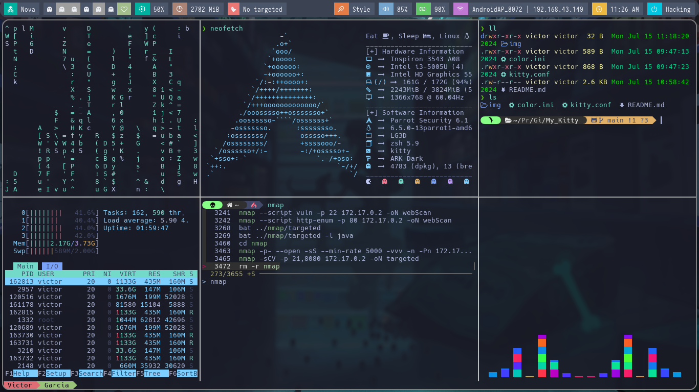
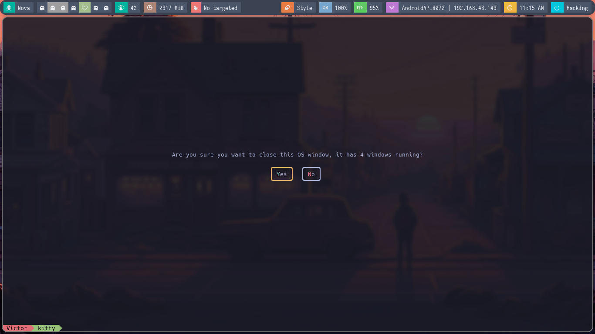

# Configuración de Kitty

Esta es mi configuración personalizada para el emulador de terminal Kitty. Incluye una configuración de colores, mapeos de teclas, y otras personalizaciones para mejorar la experiencia de uso.

### Ejemplos:


Redimencionar y renombrar venatanas.


Ejemplo práctico.


Cerrar kitty.

## Requisitos

- **Kitty**: Un emulador de terminal rápido y con muchas características.
- **HackNerdFont**: Una fuente personalizada que incluye iconos Nerd Fonts. Puedes descargarla desde [Nerd Fonts](https://www.nerdfonts.com/).

## Archivos de Configuración

### color.ini

- El archivo `color.ini` define el esquema de colores utilizado por Kitty.

### kitty.conf

- El archivo `kitty.conf` contiene la configuración general y los mapeos de teclas para Kitty.

### Mapeo de Teclas

- **ctrl+left**: Moverse a la ventana vecina a la izquierda.
- **ctrl+right**: Moverse a la ventana vecina a la derecha.
- **ctrl+up**: Moverse a la ventana vecina arriba.
- **ctrl+down**: Moverse a la ventana vecina abajo.
- **F1**: Copiar al buffer 'a'.
- **F2**: Pegar desde el buffer 'a'.
- **F3**: Copiar al buffer 'b'.
- **F4**: Pegar desde el buffer 'b'.
- **ctrl+shift+z**: Alternar diseño en stack.
- **ctrl+shift+enter**: Nueva ventana con el directorio de trabajo actual.
- **ctrl+shift+t**: Nueva pestaña con el directorio de trabajo actual.
- **ctrl+shift+alt+t**: Renombrar pestaña actual
- **ctrl+shift+r**: Redimensionar la ventana actual.
- **ctrl+shift+l**: Alternar entre organizar ventanas horizontalmente y verticalmente.
- **ctrl+shift+w**: Cerrar ventanas o pestañas.
- **ctrl+shift+left**: Moverse a la pestaña izquierda.
- **ctrl+shift+right**: Moverse a la pestaña derecha.

## Instalación

### Clonar el Repositorio

Clona este repositorio en tu máquina local:

```sh
git clone https://github.com/anonymous-17-03/My_Kitty.git
```

### Hacer una Copia de Seguridad

Antes de realizar cambios, siempre es buena idea hacer una copia de seguridad de tu configuración actual:

```sh
cp ~/.config/kitty/kitty.conf ~/.config/kitty/kitty.conf.bak
cp ~/.config/kitty/color.ini ~/.config/kitty/color.ini.bak
```

### Copiar la Configuración
Copia los archivos de configuración a la carpeta de configuración de Kitty:

```sh
cp kitty-config/color.ini ~/.config/kitty/color.ini
cp kitty-config/kitty.conf ~/.config/kitty/kitty.conf
```

## Nota

Ten en cuenta que yo uso **zsh** como shell principal, junto con la configuración de [Powerlevel10k](https://github.com/romkatv/powerlevel10k). Asegúrate de instalar y configurar zsh, para obtener la misma apariencia y funcionalidad en tu terminal o si lo desea puede usar  bash cambiando la ultima linea del `kitty.conf` que dice `shell zsh` a `shell bash`.

